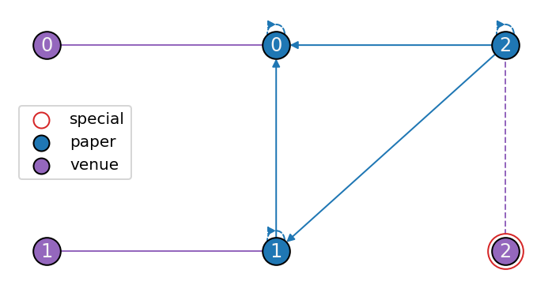

# APPrOVE: Approximate Personalized Propagation Over Varied Edges

[](https://approve.readthedocs.io/en/latest/?badge=latest)
 [](https://github.com/mrmrob003/approve/actions/workflows/test.yml) [](https://codecov.io/gh/mrmrob003/approve) [](https://github.com/psf/black) [](https://opensource.org/licenses/MIT)

## 😎 Summary

A [PyTorch Geometric](https://pytorch-geometric.readthedocs.io/en/latest/index.html) implementation of _APPrOVE: Approximate Personalized Propagation Over Varied Edges_. APPrOVE extends the well-known personalized PageRank algorithm to heterogeneous graphs (graphs with varied edges) and furnishes a message-passing layer that generalises the propagation scheme of ["Predict then Propagate: Graph Neural Networks meet Personalized PageRank"](https://arxiv.org/abs/1810.05997).

## 🚀 Installation

The most recent release can be installed from
[PyPI](https://pypi.org/project/approve/) with:

```bash
$ pip install approve
```

The most recent code can be installed directly from GitHub with:

```bash
$ pip install git+https://github.com/mrmrob003/approve.git
```

## 🏃 Getting Started
To demonstrate our heterogeneous personalized PageRank algorithm, consider the following toy-model of a citation network consisting of three papers and two venues.

<p align="center">
  
</p>

Paper `0` is cited by the other two papers and published by venue `0`, while paper `1` is cited by paper `2` and published by venue `1`.

We can represent this citation network as a `torch.data.HeteroData` object as follows:

```python
hetero_data = HeteroData()
hetero_data['paper', 'cites', 'paper'].edge_index = torch.tensor(
    [[1, 2, 2],
     [0, 0, 1]]
)
hetero_data['venue', 'publishes', 'paper'].edge_index = torch.tensor(
    [[0, 1],
     [0, 1]]
)
hetero_data['paper', 'rev_publishes', 'venue'].edge_index = \
    hetero_data['venue', 'publishes', 'paper'].edge_index[[1, 0]]
hetero_data['paper'].num_nodes = 3
hetero_data['venue'].num_nodes = 2
```

To compute the type-sensitive PageRank score of each node, we uniformly assign an initial fraction (of the total score for a given node type) to all nodes of a given type. For example, since there are three papers and two venues, we assign each paper a third of the total `'paper'` score and each venue half of the total `'venue'` score. 

We can store these initial scores as follows:

```python
hetero_data['paper'].x = torch.full((3, 1), 1 / 3)
hetero_data['venue'].x = torch.full((2, 1), 1 / 2)
```

In addition, we need to add self-loops to `'paper'` nodes, and a special edge from paper `2` (which is as-yet-unpublished) to a special `'venue'` node, as depicted below.

<p align="center">
  
</p>

The addition of the self-loops, the special edge and the special node prevents the total score for each node type from leaking. The `approve.models.HeteroAPPr` model takes care of all these considerations. The model can be easily used to compute the type-sensitive PageRank score of each node as follows:

```python
model = HeteroAPPr(K=30)
output = model(
    hetero_data.x_dict, 
    edge_index_dict=hetero_data.edge_index_dict,
)
output
```
```
{'paper': tensor([[0.4605],
         [0.3289],
         [0.2105]]),
 'venue': tensor([[0.4803],
         [0.4145],
         [0.1053]])}
```

Unsurprisingly, paper `0` is the most important paper, since it is cited by the other two papers. Venues `0` and `1` have comparable scores; venue `0`'s score is slighlty larger than venue `1`'s score, because venue `0` publishes a higher-ranked paper than the paper published by venue `1`. Venue `2`, the special `'venue'` node, has a comparably low score because it relates to the lowest ranked paper.

## 👋 Attribution

### ⚖️ License
The code in this package is licensed under the [MIT License](./LICENSE).

### 📖 Citation
If you use this software in your work, please cite it using the "Cite this repository" widget located on the sidebar.
